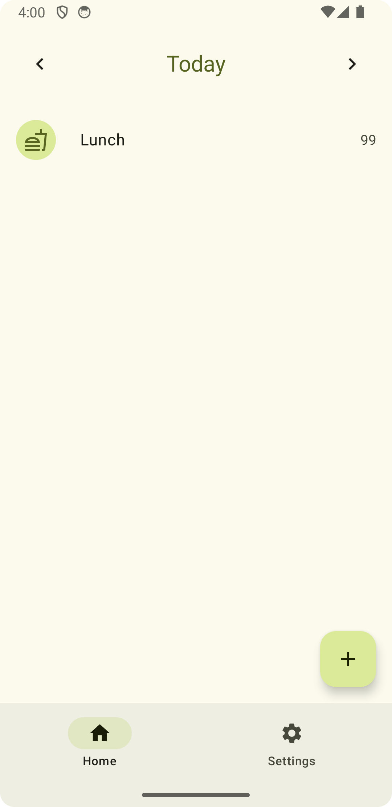
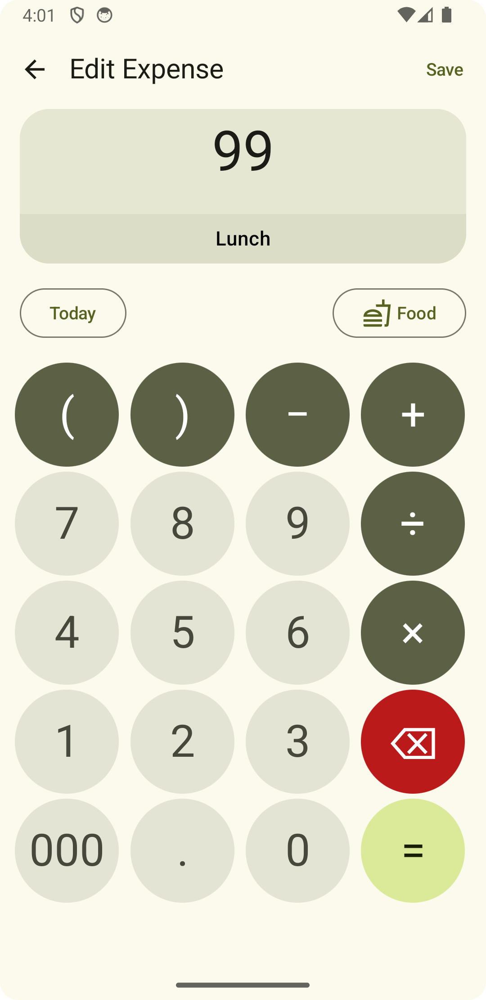

# A3 - Expense Tracker

A very simple multiplatform expense tracking application built with Kotlin Multiplatform and Compose multiplatform.

## Screenshots

    </img>
    </img>

## Features

- Track expenses with categories and details
- View expenses by date 
- Export/import data in JSON format
- Cross-platform support (Android, iOS, Desktop)
- Material 3 design

## Tech Stack

- **Kotlin Multiplatform** - Shared codebase across platforms
- **Compose Multiplatform** - Modern UI toolkit
- **SQLDelight** - Database 
- **Keval** - Mathematical expression evaluation
- **Koin** - Dependency injection
- **Kotlinx Serialization** - JSON serialization
- **Kotlinx DateTime** - Date/time handling

## Getting Started

1. Clone the repository
2. Open the project in Android Studio
3. Run the app on your desired platform
